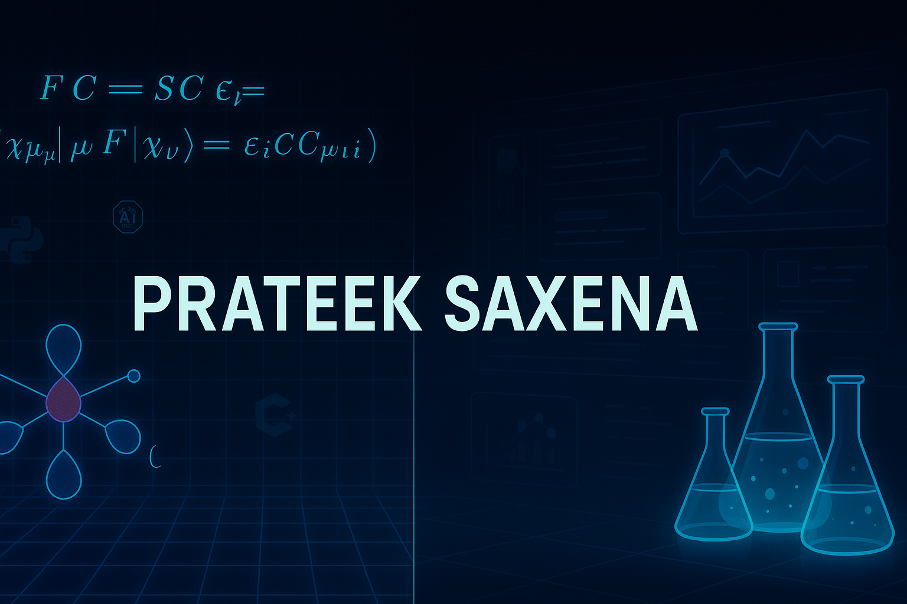

  

# 👋 Hi, I'm Prateek Saxena
🎓 Dual-degree student (M.Sc. Chemistry + B.E. Chemical) @ BITS Pilani  
💡 I blend **quantum chemistry**, **AI for education**, and **engineering simulations**  
🧠 Passionate about open-source, research, and building tools that matter  

---

## 🔭 Current Projects

🚀 **Hartree-Fock Quantum Chemistry Solver**  
A fully modular, C++-based SCF solver supporting RHF/UHF. Built from scratch — no external libraries.  
[🔗 View Project](https://github.com/heyy-Prateek/hf_prateek) | `C++` `Quantum` `Numerical Algorithms`

🧪 **Chemical Engineering Lab Simulator**  
Streamlit-based platform to simulate experiments with AI assistant, auto quiz/report generation.  
[🔗 View Project](https://github.com/heyy-Prateek/chem-lab-sim) | `Python` `Streamlit` `LLMs` `EdTech`

🌱 **Sustainable Bioplastics Research**  
Studying biodegradable alternatives to petroleum-based plastics using agro waste & additives.  
ℹ️ GitHub coming soon! | `Research` `Sustainability` `Materials`

🌐 **Personal Portfolio Website**  
A sleek, custom-built portfolio showcasing my work, background, and vision.  
[🔗 View GitHub](https://github.com/heyy-Prateek/portfolio-website) | [🔗 Visit Site](https://prateeksaxena.dev) | `HTML` `CSS` `JavaScript`

---

## 🧰 Tech Stack

---

## 📈 GitHub Stats

  
  

---

## 📫 Get in Touch

📧 Email: f20212756@pilani.bits-pilani.ac.in  
🔗 [GitHub](https://github.com/heyy-Prateek)  
🔗 [LinkedIn](https://www.linkedin.com/in/prateek-saxena-35845219a/)  
🌐 [Portfolio Website] Coming soon!! 

---

> “Build the tools you wish you had.” – My guiding philosophy
